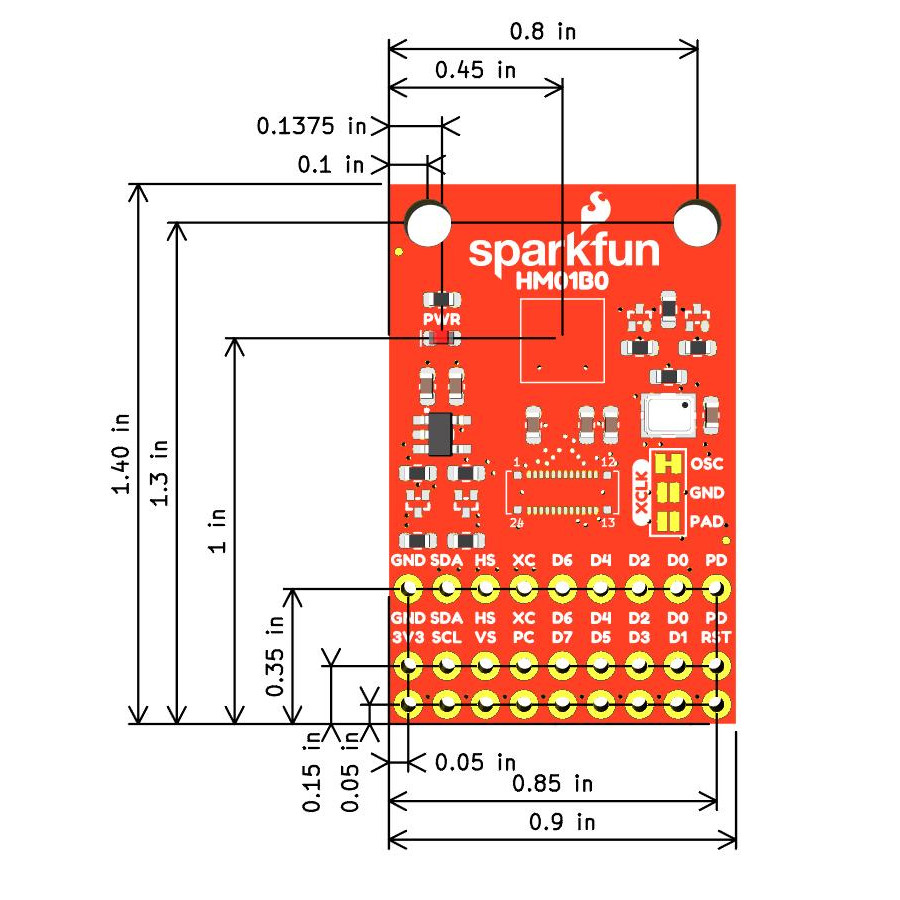

Let's take a closer look at the Camera Board - HM0B10 and the hardware on it.

## Himax HM0B10 Camera Module (Color)

The HM0B10 camera module from Himax&reg; has a 320 x 320 pixel resolution that supports frame rates of up to 51FPS in full resolution (320x320) and up to 60FPS in windowed/QVGA (320x240) operation. The camera module also has a 2x2 monochrome binning mode that supports up to 120FPS if you're looking to maximize frame rate over resolution and color. The HM01B0 also has a motion detect feature tied to an interrupt output so you can program it to wake up your camera project whenever it senses motion. The video data interface communicates over a configurable 1, 4 or 8bit interface that features both video frame for synchronizing multiple cameras and line sync for creating a composite image from two cameras. The HM01B0 operates over a I2C serial interface with an address of <b>0x24</b>. For complete information on the HM0B10, refer to the [datasheet](https://cdn.sparkfun.com/assets/7/f/c/8/3/HM01B0-MNA-Datasheet.pdf).

## Pinout

The Camera Board breaks out all of the HM0B10's pins to three 9 pin, 0.1"-spaced plated through hole headers. The three headers are split into a single "top" header and a pair of "bottom" headers and we'll refer to them as "Top" and "Bottom" for the descriptions and tables below. Several pins are shared between the two sets. The Top header breaks out the minimum pins needed for basic use of the camera module and the Bottom header pair breaks out all the pins. This bottom pair connects directly to the 2x10 connector on the Red Vision Touch Display.

The tables below outline the pin name, type and function of the pins broken out to each header:

**Top Header Pinout**
<table>
    <tr>
        <th>Pin Label/Name</th>
        <th>Type</th>
        <th>Function</th>
    </tr>
    <tr>
        <td>GND/Ground</td>
        <td>Ground</td>
        <td>Ground</td>
    </tr>
    <tr>
        <td>SDA</td>
        <td>In/Out</td>
        <td>I2C Serial Data I/O (Open Drain)</td>
    </tr>
    <tr>
        <td>HS/HSYNC</td>
        <td>Output</td>
        <td></td>
    </tr>
    <tr>
        <td>XC/Clock</td>
        <td>Input</td>
        <td>Main/External Clock Input</td>
    </tr>
    <tr>
        <td>D6</td>
        <td>Output</td>
        <td>Data 6 Output</td>
    </tr>
    <tr>
        <td>D4</td>
        <td>Output</td>
        <td>Data 4 Output</td>
    </tr>
    <tr>
        <td>D2</td>
        <td>Output</td>
        <td>Data 2 Output</td>
    </tr>
    <tr>
        <td>D0</td>
        <td>Output</td>
        <td>Data 0 Output</td>
    </tr>
    <tr>
        <td>PD/Cam Powerdown</td>
        <td>Input</td>
        <td>Camera Voltage Regulator Enable</td>
    </tr>
</table>

**Bottom Header Pair Pinout**
<table>
    <tr>
        <th>Pin Label/Name</th>
        <th>Type</th>
        <th>Function</th>
    </tr>
    <tr>
        <td>GND/Ground</td>
        <td>Ground</td>
        <td>Ground</td>
    </tr>
    <tr>
        <td>3V3/3.3V</td>
        <td>Voltage Input</td>
        <td>Voltage Regulator 3.3V Input</td>
    </tr>
    <tr>
        <td>SDA</td>
        <td>In/Out</td>
        <td>I2C Serial Data I/O (Open Drain)</td>
    </tr>
    <tr>
        <td>SCL</td>
        <td>Input</td>
        <td>I2C Clock Signal</td>
    </tr>
    <tr>
        <td>HS/HSYNC</td>
        <td>Output</td>
        <td></td>
    </tr>
    <tr>
        <td>VS/VSYNC</td>
        <td>Output</td>
        <td>Frame Valid Output</td>
    </tr>
    <tr>
        <td>XC/Clock</td>
        <td>Input</td>
        <td>Main/External Clock Input</td>
    </tr>
    <tr>
        <td>PC/PCLOCK/SCK</td>
        <td>Output</td>
        <td>Pixel Clock or Serial Clock Output</td>
    </tr>
    <tr>
        <td>D6</td>
        <td>Output</td>
        <td>Data 6 Output</td>
    </tr>
    <tr>
        <td>D7</td>
        <td>Output</td>
        <td>Data 7 Output</td>
    </tr>
    <tr>
        <td>D4</td>
        <td>Output</td>
        <td>Data 4 Output</td>
    </tr>
    <tr>
        <td>D5</td>
        <td>Output</td>
        <td>Data 5 Output</td>
    </tr>
    <tr>
        <td>D2</td>
        <td>Output</td>
        <td>Data 2 Output</td>
    </tr>
    <tr>
        <td>D3</td>
        <td>Output</td>
        <td>Data 3 Output</td>
    </tr>
    <tr>
        <td>D0</td>
        <td>Output</td>
        <td>Data 0 Output</td>
    </tr>
    <tr>
        <td>D1</td>
        <td>Output</td>
        <td>Data 1 Output</td>
    </tr>
    <tr>
        <td>PD/Cam Powerdown</td>
        <td>Input</td>
        <td>Camera Voltage Regulator Enable</td>
    </tr>
    <tr>
        <td>RST/Reset</td>
        <td>Input</td>
        <td>Camera Voltage Regulator Reset</td>
    </tr>
</table>

## LED

The sole LED on this board is a red Power LED to indicate whenever the board has power over 3.3V. 

## Solder Jumpers

The Camera Board has six solder jumpers labeled: <b>OSC</b>, <b>GND</b>, <b>PAD</b>, <b>OSC_DIS</b>, <b>LED</b> and <b>I2C</b>. The lists below outlines each solder jumper's function, default state and any notes on their use. Note, manipulating these solder jumpers is only recommended for *advanced users* as they alter the functionality of the board, change the pins used by it and require knowledge of [working with jumper pads and PCB traces](https://learn.sparkfun.com/tutorials/how-to-work-with-jumper-pads-and-pcb-traces). 

**Oscillator Jumpers:**

These solder jumpers all adjust which oscillator source connects to the camera's external clock (XCLK) pin or to use the camera's internal oscillator. The board defaults to run at 24MHz with an on board oscillator. Make sure to only connect XCLK to a **single** source at a time otherwise unexpected behavior or damage may occur.

* <b>OSC</b>: This solder jumper enables the on board 24MHz oscillator by connecting it to the HM01B0's XCLK pin. It is CLOSED by default. Sever the trace in between the solder jumpers to open the jumper and disable the 24MHz clock source. 
* <b>PAD</b>: This solder jumper connects the HM0B10's XCLK pin to the PTH pads on the board labeled <b>XC</b> so users can connect an external clock source. The jumper is OPEN by default. Close the jumper to enable the <b>XC</b> pin. Make sure both the <b>OSC</b> and <b>GND</b> jumpers are OPEN when connecting a clock source to the <b>XC</b> pin. **Note:** When connected to the Red Vision Touch Display, this signal connects to GPIO3 on the XRP Control Board (or Pico).
* <b>GND</b>: This solder jumper pulls the HM0B10's XCLK pin to ground to enable the camera's internal 48MHz oscillator. It is OPEN by default. Close the jumper to enable the internal oscillator. Make sure both the <b>OSC</b> and <b>PAD</b> jumpers are OPEN before closing this jumper.
* <b>OSC_DIS</b>: This solder jumper controls whether the 28MHz oscillator on the board is on or off. It is OPEN by default and enables the crystal. Close the jumper to disable the 28MHz oscillator.

**Other Jumpers:**
* <b>LED</b>: The LED jumper completes the Power LED circuit and is CLOSED by default. Open the jumper to disable the Power LED.
* <b>I2C</b>: The I2C jumper pulls the camera's SDA and SCL lines to <b>3.3V</b> through a pair of resistors. This three-way jumper is CLOSED by default. Opening the jumper completely disables the pullup resistors on the SDA/SCL lines.

## Board Dimensions

The SparkFun Red Vision Camera Board - HMB010 measures 0.9" x 1.40" (22.86mm x 35.56mm) and has two mounting holes that fit a [4-40 screw]().

<figure markdown>
[{ width="600"}](./assets/board_files/SparkFun_Red_Vision_Camera_Board_HM01B0.jpg "Click to enlarge")
</figure>