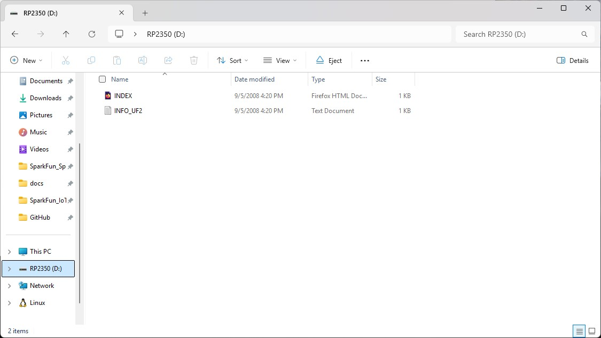

The SparkFun Red Vision Kit for XRP requires updated firmware to run properly. This firmware updates the XRP Control Board with the right drivers to work with the Vision Kit and also includes all of the MicroPython OpenCV examples included in the package. In this section we'll go over where to find this firmware to download, how to upload it to your XRP Control Board and where to open the examples once you've assembled the Vision Kit onto your XRP Kit. 

!!! Note
    We recommend updating the firmware on the XRP Control Board prior to installing the Vision Kit boards onto it as the Touch Display makes it difficult to reach the RESET and BOOT buttons.

## Vision Kit MiroPython Firmware

First things first, we need to download the Red Vision Kit firmware UF2 file from GitHub. If you're not familiar with what a UF2 file is and want to learn more, read more about them in this [Make Code post](https://makecode.com/blog/one-chip-to-flash-them-all). The SparkFun Red Vision firmware UF2 file is available for download from the [SparkFun MicroPython Firmware Releases](https://github.com/sparkfun/micropython/releases) on GitHub. The firmware file is named **RED_VISION_MICROPYTHON_SPARKFUN_XRP_CONTROLLER** so you'll need to click the "Show all ## Files" button at the bottom of the list and then scroll down until you find the file. Download the "RED_VISION_MICROPYTHON_SPARKFUN_XRP_CONTROLLER" file and take note of where it is saved on your computer.

## Entering Boot Mode on the XRP

Next, put the XRP Control Board into Boot Mode using the following steps:

* Connect the XRP Control Board to your computer over USB-C.
* Locate the Reset and Boot buttons.
* Press and hold the BOOT button down.
* Press and release the RESET button (while still holding the BOOT button).
* Release the BOOT button and the XRP Control Board should open as a removable drive named "RP2350" on your computer.

<figure markdown>
[{ width="600"}](./assets/img/RP2350_Drive_screenshot.jpg "Click to enlarge")
</figure>

## Uploading Firmware

!!! note "Backup Your Files"
    Important! Make sure to back up any files/examples you have saved on your XRP as the new firmware *will* overwrite them.

Now that the XRP Control Board is in BOOT mode and open as a removable drive all we need to do is place the Vison Kit Firmware uF2 file in the XRP Control Board drive location. Open the download location for the firmware file and either drag the file over to the XRP drive or copy and paste it over. The upload can take about a minute to complete.

<figure markdown>
[{ width="600"}](./assets/img/UF2%20Transfer.jpg "Click to enlarge")
</figure>

After installing the firmware file, the XRP Control board should reset automatically and drop out of BOOT mode and we can move on to using the SparkFun MicroPython OpenCV examples.