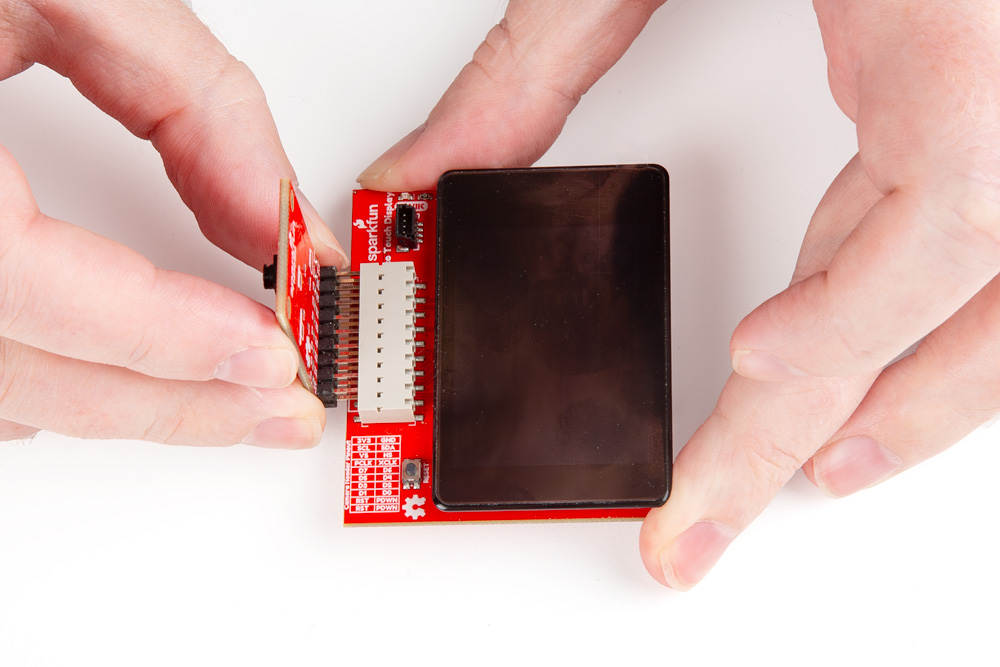

Now that we're familiar with the Vision Kit's Camera Board andTouch Display and have the updated firmware installed on the XRP Control Board, it's time to connect everything up to the XRP Kit.

## Connect Camera Board and Touch Display

Start by connecting the Camera Board to the Touch Display by plugging the 2x9 header on the Camera Board into the 2x10 header on the Touch Display. **IMPORTANT**: Make sure to align the Camera Board to the "LEFT" side of the 2x10 header on the Red Vision Touch Display like the photo below shows:

<figure markdown>
[{ width="600"}](./assets/img/Red-Vision-Assembly-1.jpg "Click to enlarge")
</figure>

## Connect Touch Display to XRP Control Board

Next, carefully align the pins on the bottom of the Red Vision Touch Display with the "Inner/Center" pair of connectors on the XRP Control Board like the photo below:

<figure markdown>
[{ width="600"}](./assets/img/Red-Vision-Assembly-2.jpg "Click to enlarge")
</figure>

Take care to make sure the Red Vision Touch Display is plugged in facing toward the FRONT of the XRP robot and is connected fully to the correct set of headers. It is possible to connect only one set of pins on the Touch Display board to the XRP Control Board's headers and this can cause damage to the boards in the Red Vision Kit. If your assembly looks like the photo below, do *not* power up the board and reseat the Touch Display:

<figure markdown>
[{ width="600"}](./assets/img/Red-Vision-Assembly-Incorrect.jpg "Click to enlarge")
</figure>

Now that we've got our Red Vision Kit assembled and connect to the XRP robot, let's move on to some code examples!

