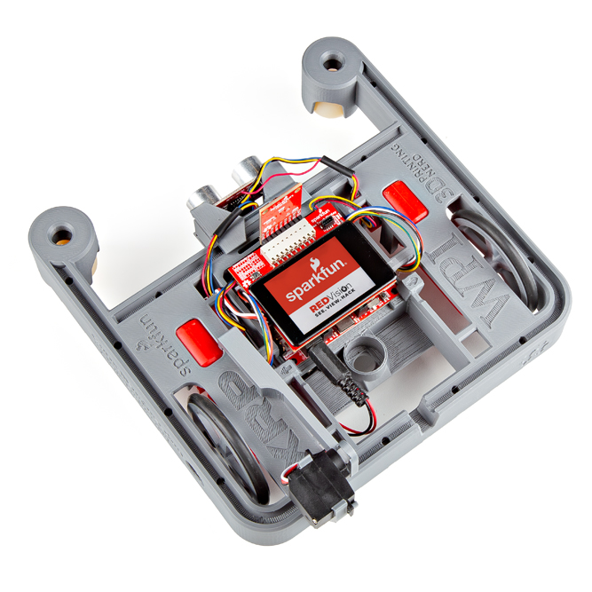

The [SparkFun Red Vision Kit for XRP](https://www.sparkfun.com/sparkfun-pico-vision-kit-for-xrp.html) features the [SparkFun Red Vision Touch Display for Pico]() and the [SparkFun Red Vision Camera Board - HM01B0 (Color)]() so you can add image processing and display to the SparkFun Experiential Robotics Kit (XRP). This Hookup Guide is written primarily for users with the Red Vision kit but those who have just one of these boards can follow along to some degree to get their boards up and running on an XRP or Pico. Note, all code covered here assumes use of the full Red Vision kit connected to an XRP Kit.

<figure markdown>
[{ width="600"}](https://www.sparkfun.com/sparkfun-pico-vision-kit-for-xrp.html)
</figure>

## Required Matierals

In order to follow along with this guide, you'll need the following materials:

* [SparkFun Red Vision Kit for XRP](https://www.sparkfun.com/sparkfun-pico-vision-kit-for-xrp.html)
* [SparkFun XRP Kit](https://www.sparkfun.com/experiential-robotics-platform-xrp-kit.html) (The Red Vision Kit does **not** work with the [Beta version](https://www.sparkfun.com/experiential-robotics-platform-xrp-kit-beta.html) of the XRP)
* [USB-C Cable](https://www.sparkfun.com/reversible-usb-a-to-c-cable-0-8m.html)

## Suggested Reading

This guide assumes users have a fully assembled and functioning XRP Kit and also is somewhat familiar with the XRP Code Editor. If you need help assembling your XRP Kit or getting started with the XRP and the XRP Code editor, please read through the following documentation:

* [XRP Users Guide](https://xrpusersguide.readthedocs.io/en/latest/course/introduction.html)
* [Experiential Robotics Platform Docs](https://introtoroboticsv2.readthedocs.io/en/latest/)
