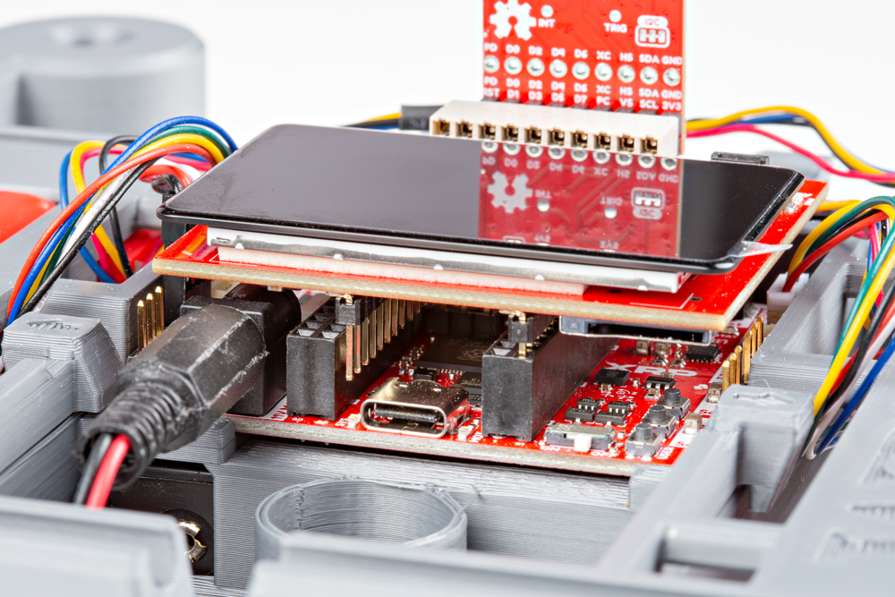

This Quick Start Guide covers how to get the SparkFun Red Vision Kit for XRP assembled and running on an XRP Kit and then use the Logo Recognition example to have the display identify and outline the SparkFun flame logo when the camera has it in view. This guide assumes users have an assembled XRP Kit, an understanding of how the kit functions as well as how to update XRP firmware and use the XRP Code Editor. If you're not familiar with those concepts or want to learn more about the boards included in the Red Vision Kit, uploading firmware and using the Red Vision MicroPython examples, read on to the Hardware and Software sections for more detailed information.

## XRP Red Vision Firmware

!!! note "Important!"
    Updating the firmware on the XRP Control Board will overwrite any files or settings saved on the board. Make sure to back up the contents of your XRP before updating the firmware.

Putting the XRP in Boot mode with the Red Vision Kit connected to it is a bit difficult so we'll update the firmware before connecting the Red Vision Kit with the following steps:

* Plug the XRP Control Board into your computer over USB-C.
* Download the latest release of the Red Vision MicroPtyhon Firmware from [GitHub](https://github.com/sparkfun/micropython/releases)
    * On the MicroPython releases page, click the "Show all ## assets" button at the bottom of the list and then download the UF2 file named **RED_VISION_MICROPYTHON_SPARKFUN_XRP_CONTROLLER**
* Put the XRP Control Board into BOOT mode with the following steps:
    * Press and hold the BOOT button
    * Press and release the RESET button (while holding the BOOT button)
    * Release the BOOT button.
    * Ensure the XRP Control Board appears as a removable storage device named "RP2350".
* Locate the "RED_VISION_MICROPYTHON_SPARKFUN_XRP_CONTROLLER" Firmware UF2 file and drag or copy/paste the file into the "RP2350" removable drive (This can take a while to complete.)

## Red Vision Kit Assembly with XRP

With the firmware updated, unplug the Control Board, power down the robot and then move on to assembling the Red Vision Kit with the following steps:

* Connect the Red Vision Camera Board to the Red Vision Touch Display for Pico taking care to align the Camera Board's 2x9 header to the LEFT side of the Touch Display's 2x10 connector. Refer to the photo below for proper alignment:

<figure markdown>
[{ width="600"}](./assets/img/Red-Vision-Assembly-1.jpg "Click to enlarge")
</figure>

* Plug the Red Vision Touch Display into the Control Board taking care to plug it into the "middle" set of headers on the Control Board:

<figure markdown>
[{ width="600"}](./assets/img/Red-Vision-Assembly-2.jpg "Click to enlarge")
</figure>

Take care to make sure the Pico Touch Display is plugged in facing toward the *front* of the XRP robot and is connected fully to the correct set of headers. It is possible to connect only one set of pins on the Touch Display board to the XRP Control Board's headers and this can cause damage to the boards in the Red Vision Kit. If your assembly looks like the photo below, do *not* power up the board and reseat the Touch Display:

<figure markdown>
[{ width="600"}](./assets/img/Red-Vision-Assembly-Incorrect.jpg "Click to enlarge")
</figure>

## Example Code

Now that we've got the proper firmware installed and the Red Vision Kit connected to the XRP robot, let's take a look at the SparkFun Logo Recognition example included with the firmware. Upload the example by following the steps below:

* Open the [XRP Code Editor](https://xrpcode.wpi.edu/) in a Chromium&trade;C based browser (Chrome, Edge, etc.)
    * If you have not already, set the main power switch on the XRP Control Board to "On". The XRP Code Editor has a pop-up for this as well if you try and run code without the board powered on fully.
* Connect the XRP to the Code Editor. The window may open a pop-up asking to update the firmware. Click "Cancel" as updating the firmware will overwrite the MicroPython OpenCV firmware. A second pop-up may open asking to update libraries, click "Ok" to update the libraries. This will *not* affect the behavior or examples and is necessary to run other XRP examples.
* Open the folder named "red_vision_examples" and double click the file named "ex06_detect_sfe_logo.py" to open the code.
* Next, click the green "RUN" button in the top-right of the XRP Code Editor window.
* With the code running, we've printed out a black and white image with three objects on it; a star, the SparkFun flame and a heart. When holding it in front of the camera it should outline it and give information on the size and location of the logo. If you'd like to replicate this at home, just hold up your SparkFun red box or another SparkFun board point the logo on it at the camera. It should identify it; outline it and give information on the size and location of the logo similarly to the photo below:

<figure markdown>
[{ width="600"}](./assets/img/Logo-Example-2.jpg "Click to enlarge")
</figure>

This close-up photo offers a better view of what the Touch Screen Display shows when the SparkFun logo is detected in camera frame. You can see in the top left what contour the code is looking for, the bounding box and outline of the logo along with information on the position of the logo's center on the screen (green numbers) and the size of the bounding box (white numbers).

<figure markdown>
[{ width="600"}](./assets/img/Logo-Example-1.jpg "Click to enlarge")
</figure>