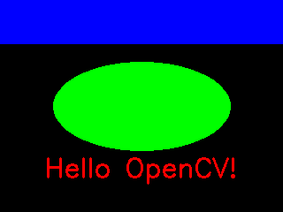
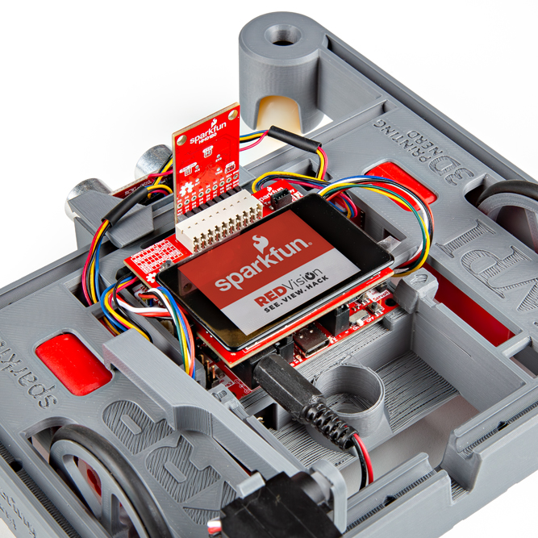
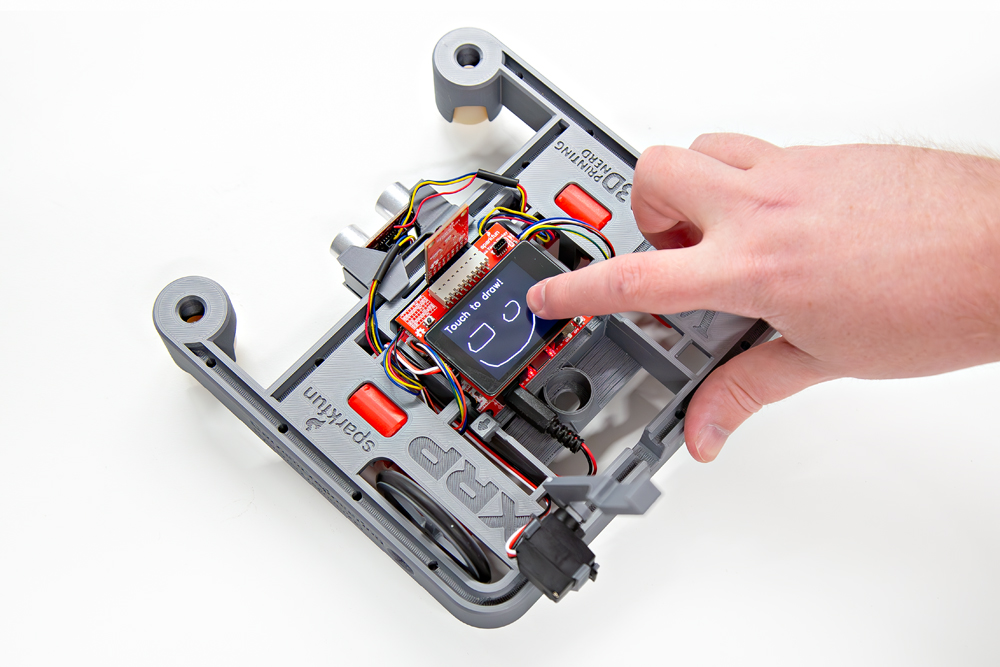
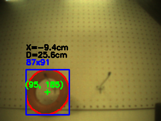
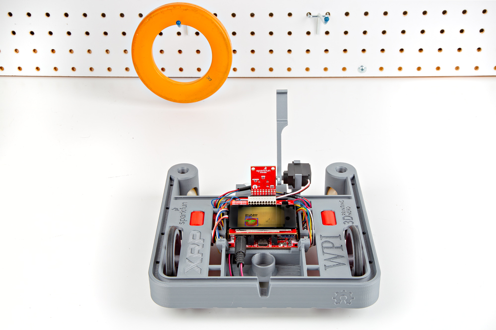

Now that we have the XRP Code editor up and running with our XRP Kit connected, let's take a look at some of the examples.

## Example 01 - Hello OpenCV

The first example is set up as a hardware test for the Touch Display board and the LCD. It initializes the display and creates a template image of text and shapes. On the left-hand side of the XRP Code editor, open the Red Vision Examples folder and double-click on "ex01_hello_opencv.py". Once it opens, click the green "Run" button in the top-right of the window. You should see the display initialize and then show the image below:

<figure markdown>
[{ width="600"}](./assets/img/hello_opencv.png "Click to enlarge")
</figure>

## Example 02 - Camera

The second example performs a similar hardware test but this time for the Camera Board and the HM0B10. It initializes both the camera and display, shows a quick splash image and then shows whatever the camera sees on the display. In the Red Vision Examples folder, double-click on "ex02_camera.py". After opening the file, click the "Run" button and you should see the display initialize with the splash screen pictured below followed by a greyscale stream of what the camera is viewing. 

<figure markdown>
[{ width="600"}](./assets/img/Red-Vision-Assembly-3.jpg "Click to enlarge")
</figure>

Try moving the camera around or placing objects in front of it to test the video stream.

## Example 03 - Touch Screen

The third example tests the touch screen functionality by "turning on" pixels touched by a finger or other capacitive source (stylus, etc.). Double-click on "ex03_touch_screen.py" in the OpenCV Examples folder and click the "Run" button. The screen initializes with the same splash display as before and then follows it with a black screen with "Touch to Draw" printed in white text at the top of the screen. Try moving your finger across the display to draw or write something and you should see the display update following that path. It's not extremely precise as it's just a 240x240px display but you can draw a frumpy smiley face like the image below:

<figure markdown>
[{ width="600"}](./assets/img/Touch-Screen-Example.jpg "Click to enlarge")
</figure>

## Example 06 - Detect SFE Logo

The sixth example demonstrates how to use a basic vision processing pipeline. A pipeline is a sequence of steps used to extract meaningful data from an image. In this example, the pipeline attempts to have the camera detect the SparkFun flame logo using contour matching. In the XRP Code Editor, double click "ex_06_detect_sfe_logo.py" to open the example and click the "Run" button.

While the example is running, if the camera detects the logo in frame, it outlines it on the display and draws a bounding box along with a target over the center of the logo to show how to get useful numerical data from an image such as the position and size of an object:

<figure markdown>
[{ width="600"}](./assets/img/Logo-Example-1.jpg "Click to enlarge")
</figure>

For our testing we have a nice big black and white print out with three objects on it; a star, SparkFun flame and heart. Now you may not have the same thing handy but if you've got a SparkFun red box or SparkFun board, try holding that up to the camera with the SparkFun flame in frame and the code should recognize it and outline it on the display just like the image above.

## XRP Example 01 - Touch Drive

The next two examples are nested in another folder within the "red_vision_examples" folder called "xrp_examples". Click on the "xrp_examples" folder to open it up and then double-click on the example named "ex01_touch_screen_drive.py" to open the code. This example creates a simple touch screen interface to drive the XRP robot. It displays four arrows to drive the robot forwards, backwards and to turn it left and right along with a stop button to exit the example.

<figure markdown>
[{ width="600"}](./assets/img/Red-Vision-GIF-XRP-Turn.gif "Click to enlarge")
</figure>

## XRP Example 02 - Grab Orange Ring

The second XRP example demonstrates how to combine object presence and position along with driving the robot towards the detected object. This takes a lot of what we've covered in the previous examples and puts them all together. Open the example in the XRP Code Editor by double clicking "ex02_grab_orange_ring.py". This example requires a bit of setup so it waits on a user input from the USER button on the XRP Control Board. We start by lining the robot up facing the orange ring so the camera identifies the object, outlines it and gets positional and distance data to the ring:

<figure markdown>
[{ width="600"}](./assets/img/ring.png "Click to enlarge")
</figure>

### Calculating Distance and Center Offset

Look closely at the image and you'll see the ring is not just outlined with pixel position data (95, 185), it also shows information on the offset from center of the camera's point of view (X=-9.4cm) as well as the approximate distance to the ring (D=25.6cm). We calculate the distance to the ring using the following formula: 

distance_cm = diameter_cm * focal_length_px / diameter_px

We're solving for "distance_cm" so we need the real world diameter of the ring (diameter_cm=12.7cm), the focal length pixel size (focal_length_px = 660 / 3.6) and the diameter of the ring in pixels (diameter_px = max(width, height)). 

Now that we have the approximate distance, we use that information to solve for how far left (negative units) or right (positive units) the ring is from the center in real world units using the following formula:

position_x_cm = distance_cm * position_x_px / focal_length_px

In the image above you'll see this ends up measuring as -9.4cm so the camera sees the ring as roughly 9.4cm left of center.

### User Input and Movement

Alright, that's enough math, let's see the robot move and grab the ring! Once you see the ring outlined on the Touch Display with values for distance and offset, press the USER button and the XRP robot will start navigating toward the ring and once it thinks it's in the right spot will lift the servo arm to grab the ring:

<figure markdown>
[{ width="600"}](./assets/img/Red-Vision-GIF-XRP-Ring-Grab.gif "Click to enlarge")
</figure>

### Tips for Recreating Grab Ring Example

This example can be difficult to recreate on your own as it's looking for a specific object; an orange ring that is 12.7cm in diameter. If you'd like to try and recreate this example, you'll need to start with a ring roughly the same size and then adjust a few sections of the code depending on the size and color of the ring. The example specifically is looking for orange pixels so if your ring is a different color, you'll need to adjust the hue, saturation and value bounds for the color of your ring:

``` py
    # Here we use the `cv.inRange()` function to find all the orange pixels.
    # This outputs a binary image where pixels that fall within the specified
    # lower and upper bounds are set to 255 (white), and all other pixels are
    # set to 0 (black). This is applied to the HSV image, so the lower and upper
    # bounds are in HSV color space. The bounds were determined experimentally:
    # 
    # Hue: Orange hue is around 20, so we use a range of 15 to 25
    # Saturation: Anything above 50 is saturated enough
    # Value: Anything above 30 is bright enough
    lower_bound = (15, 50, 30)
    upper_bound = (25, 255, 255)
```

Next, measure the diameter of the ring and adjust line 122 in the example with the diameter in centimeters (cm):

``` py
diameter_cm = 12.7
```

Finally, this example attempts to drive the center of the XRP robot toward the orange ring so you'll need to position the servo arm on the front of the XRP robot as close as possible to the center of the robot similar to the position shown in the photo below:

<figure markdown>
[{ width="600"}](./assets/img/Ring-Example-1.jpg "Click to enlarge")
</figure>

