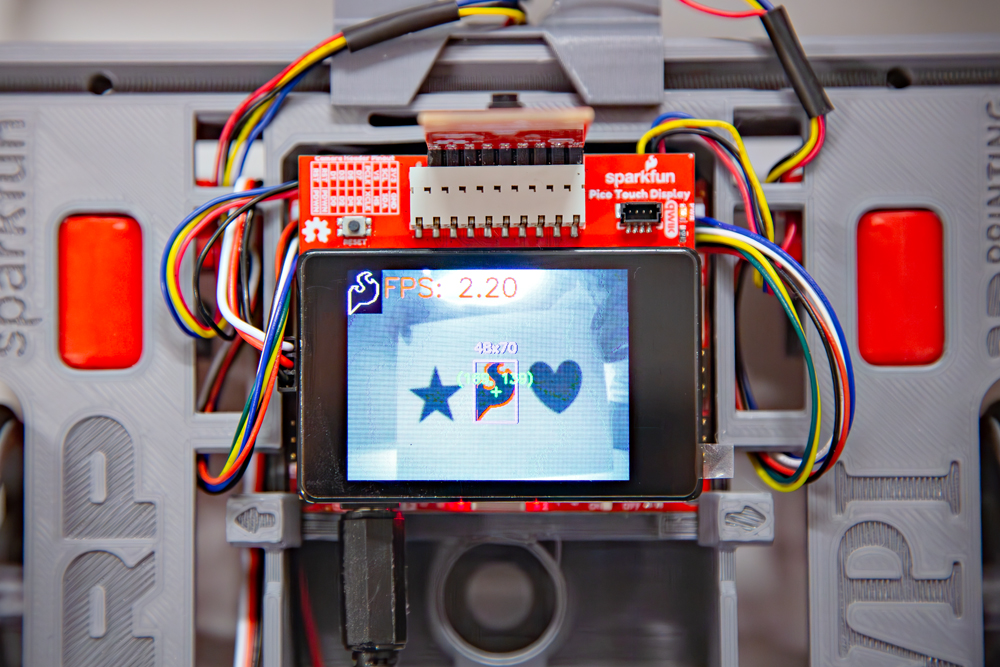

Now that we have the XRP Code editor up and running with our XRP Kit connected, let's take a look at some of the examples.

## Example 01 - Hello OpenCV

The first example is set up as a hardware test for the Touch Display board and the LCD. It initializes the display and creates a template image of text and shapes. On the left-hand side of the XRP Code editor, open the Red Vision Examples folder and double-click on "Example01_Hello_OpenCV.py". Once it opens, click the green "Run" button in the top-right of the window. You should see the display initialize and then show the image below:

<figure markdown>
    [{ width="600"}](./assets/img/hello_opencv.png "Click to enlarge")
</figure>

## Example 02 - Camera

The second example performs a similar hardware test but this time for the Camera Board and the HM0B10. It initializes both the camera and display, shows a quick splash image and then shows whatever the camera sees on the display. In the Red Vision Examples folder, double-click on "Example02_Camera.py". After opening the file, click the "Run" button and you should see the display initialize with the splash screen pictured below followed by a greyscale stream of what the camera is viewing. 

<figure markdown>
[{ width="600"}](./assets/img/Red-Vision-Assembly-3.jpg "Click to enlarge")
</figure>

Try moving the camera around or placing objects in front of it to test the video stream.

## Example 03 - Touch Screen

The third example tests the touch screen functionality by "turning on" pixels touched by a finger or other capacative source (stylus, etc.). Double-click on "Example03_Touch_Screen.py" in the OpenCV Examples folder and click the "Run" button. The screen initializes with the same splash display as before and then follows it with a black screen with "Touch to Draw" printed in white text at the top of the screen. Try moving your finger across the display to draw or write something and you should see the display update following that path. It's not extremely precise as it's just a 240x240px display but you can draw a frumpy smiley face like the image below:

<figure markdown>
[{ width="600"}](./assets/img/Touch-Screen-Example.jpg "Click to enlarge")
</figure>

## Example 06 - Detect SFE Logo

The sixth example demonstrates how to use a basic vision processing pipeline. A pipline is a sequence of steps used to extract meaningful data from an image. In this example, the pipeline attempts to have the camera detect the SparkFun flame logo using contour matching. If the camera detects the logo, it outlines it on the display and draws a bounding box along with a target over the center of the logo to show how to get useful numerical data from an image such as the position and size of an object:

<figure markdown>
[{ width="600"}](./assets/img/Logo-Example-1.jpg "Click to enlarge")
</figure>

For our testing we have a nice big black and white print out with three objects on it; a star, SparkFun flame and heart. Now you may not have the same thing handy but if you've got a SparkFun red box or SparkFun board, try holding that up to the camera with the SparkFun flame in frame and the code should recognize it and outline it on the display just like the image above.

## XRP Example 01 - Touch Drive

This example creates a simple touch screen interface to drive the XRP robot. It displays four arrows to drive the robot forwards, backwards and to turn it left and right along with a stop button to exit the example.

<figure markdown>
[{ width="600"}](./assets/img/Red-Vision-GIF-XRP-Turn.gif "Click to enlarge")
</figure>

## XRP Example 02 - Grab Orange Ring

The second XRP example demonstrates how to combine object presence and position along with driving the robot towards the detected object. 

### Tips for Example 02 - Grab Orange Ring

This example may be a bit difficult to recreate on your own as it uses a specific object (an orange ring) and also requires positioning the servo arm on the front of the XRP robot as close as possible to the center of the robot. If you'd like to try this example, first move the servo arm to the front of the XRP similar to the position shown in the photo below:

<figure markdown>
[{ width="600"}](./assets/img/Ring-Example-1.jpg "Click to enlarge")
</figure>

