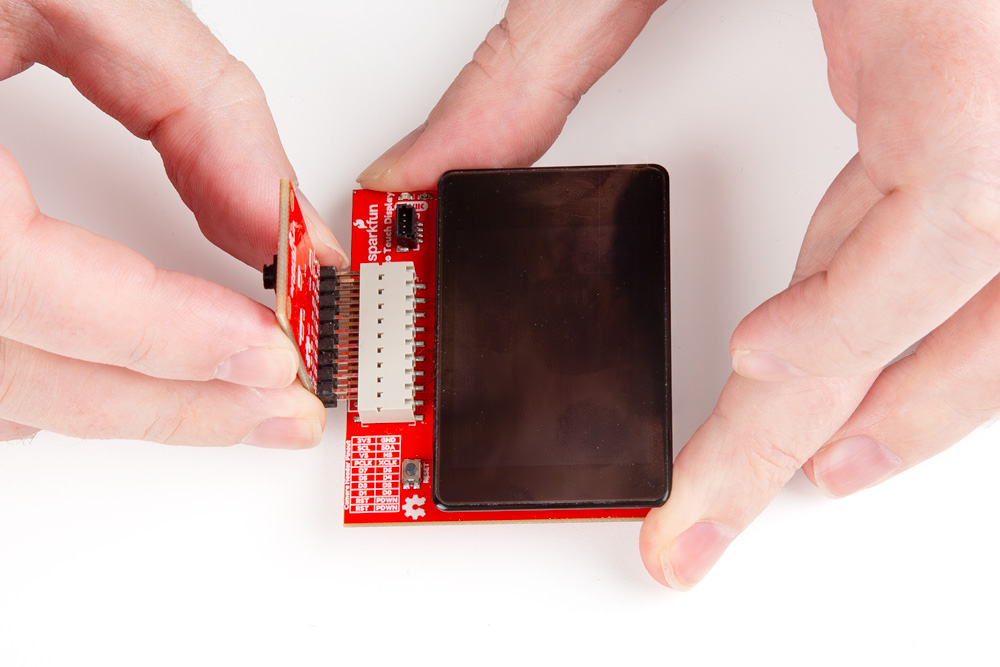
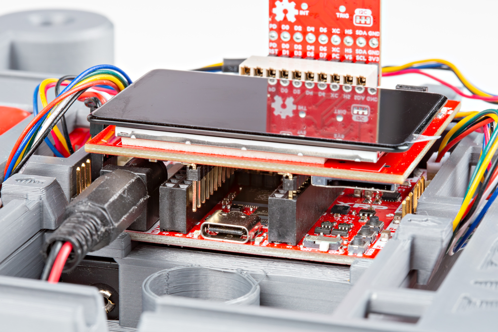

## Red Vision Assembly Tips

### Camera Board Alignment

Make sure to align the Camera Board to the "LEFT" side of the 2x10 header on the Red Vision Touch Display like the photo below shows:

<figure markdown>
[{ width="600"}](./assets/img/Red-Vision-Assembly-1.jpg "Click to enlarge")
</figure>

### Touch Display Alignment

Take care to make sure the Red Vision Touch Display is plugged in facing toward the FRONT of the XRP robot and is connected fully to the correct set of headers. It is possible to connect only one set of pins on the Touch Display board to the XRP Control Board's headers and this can cause damage to the boards in the Red Vision Kit. If your assembly looks like the photo below, do *not* power up the board and reseat the Touch Display:

<figure markdown>
[{ width="600"}](./assets/img/Red-Vision-Assembly-Incorrect.jpg "Click to enlarge")
</figure>

## SparkFun Red Vision Code Package Tips

The SparkFun MicroPython OpenCV port's [ReadMe file](https://github.com/sparkfun/red_vision?tab=readme-ov-file#sparkfun-red-vision) has comprehensive information about the entire package including detailed installation instructions, supported hardware, included OpenCV functions with descriptions of how to use them and much more.

### Hardware Configuration

The MicroPython port of OpenCV depends on hardware drivers to interface with cameras and displays. Drivers are built into the firmware, so there is no need to install them manually. 

An example module called cv2_hardware_init is imported by all examples to initialize the drivers. You will likely need to edit the files for your specific hardware and board configuration.

The standard MicroPython OpenCV firmware UF2 file contains a hardware configuration file set up specifically to work with the XRP Kit. If you're not using the Red Vision Kit with an XRP, you'll most likely need to go and change the pin assignments in the [cv2_hardware_init](https://github.com/sparkfun/micropython-opencv/blob/features_for_launch/examples/cv2_hardware_init)

### Performance

The main version of OpenCV is designed to run on desktop machines with orders of magnitude more processing power and speed so temper your expectations for the performance of this OpenCV port. 

## General Troubleshooting

!!! note
    
        <strong> Not working as expected and need help? </strong>   

    If you need technical assistance and more information on a product that is not working as you expected, we recommend heading on over to the <a href="https://www.sparkfun.com/technical_assistance">SparkFun Technical Assistance</a> page for some initial troubleshooting.   

    
<a href="https://www.sparkfun.com/technical_assistance" target="sfe_technical_assistance" class="md-button">SparkFun Technical Assistance Page</a>

    If you don't find what you need there, the <a href="https://community.sparkfun.com/">SparkFun Forums</a> are a great place to find and ask for help. If this is your first visit, you'll need to create a forum account to search product forums and post questions.  

    
<a href="https://community.sparkfun.com/" class="md-button md-button--primary">Log Into SparkFun Forums</a>
