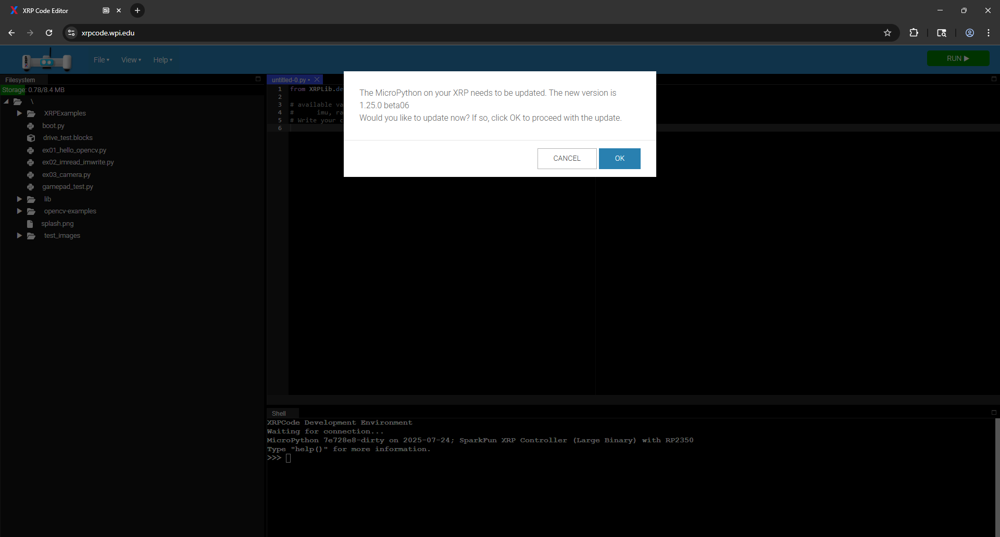

The SparkFun Red Vision Kit for XRP and SparkFun MicroPython OpenCV port can work on any MicroPython but since this guide focuses around using these boards on the XRP Kit, we'll be showing how to use these examples with the XRP Code Editor as it's tailored specifically to work with the XRP. 

## XRP Code Editor

The [XRP Code Editor](https://xrpcode.wpi.edu/) is a specialized web-based code editor for the XRP Kit to allow users to program in both Blocky and Python environments. We'll be using the Python environment. Note, the XRP Code Editor is only supported in Chromium&trade;C based browsers (Chrome, Edge, etc.).

### Connect XRP

First we need to connect the XRP to the XRP Code Editor by clicking the white "CONNECT XRP" button in the top right of the window and select "CONNECT VIA USB" in the pop-up window. Once the XRP connects you may see a pop-up asking to update the firmware. Click "CANCEL" as updating the firmware overwrites the Red Vision firmware we just installed:

<figure markdown>
[{ width="600"}](./assets/img/XRP-Code-FirmwareUpdate.png "Click to enlarge")
</figure>

Now that we've got the XRP connected to the XRP Code Editor, we can move on to running the examples for the Red Vision Kit.

